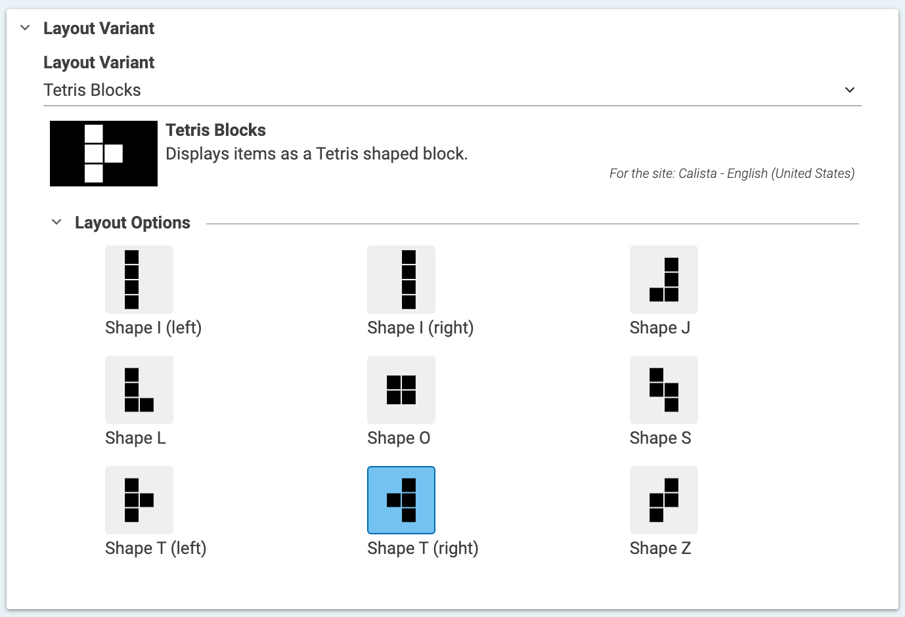
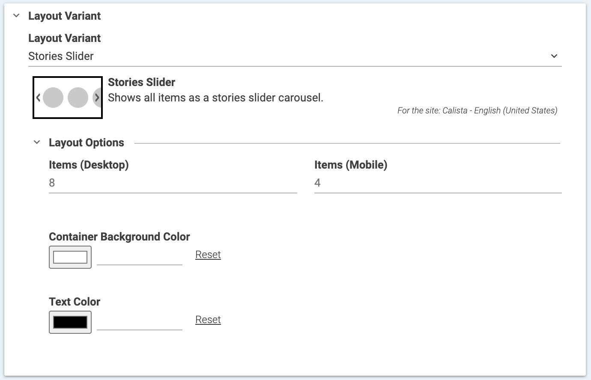
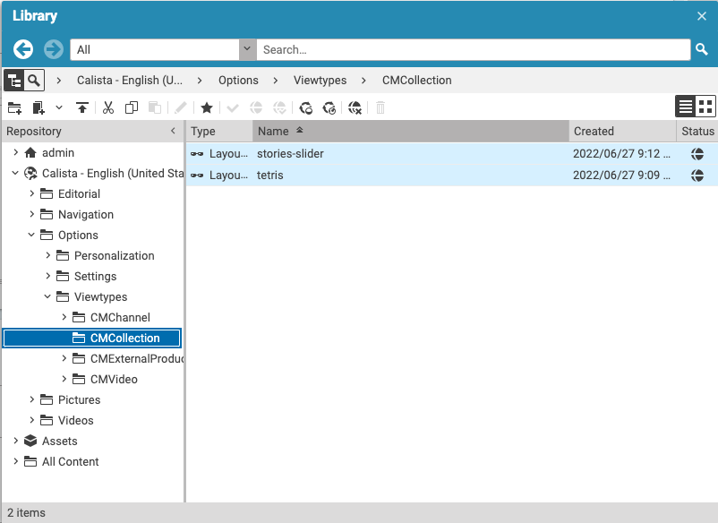
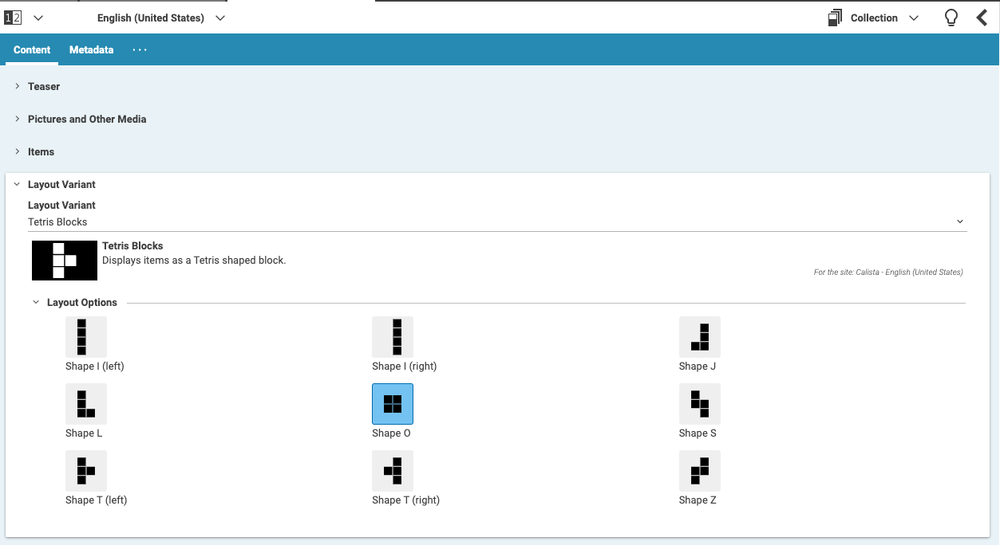

# Viewtype Configuration

This extension allows you to configure and define additional property editors for dedicated viewtypes. Let me give you some examples:
* You have a list of items that you break after a different definable amount of items on mobile and desktop
* A viewtype requires an additional setting like a look and feel or a background color

### Examples

#### Tetris



#### Slider



### Documentation & Tutorial

Read the [documentation](docs/README.md) or on [GitHub Pages](https://github.com/coremedia-contributions/viewtype-configuration/docs) for more information.

### Installation

- From the project's root folder, clone this repository as a submodule of the extensions folder. Make sure to use the branch name that matches your workspace version. In addition you will also need the 'color-picker' extensions cause the 'viewtype-configuration' relies on it.
```
git submodule add https://github.com/coremedia-contributions/viewtype-configuration modules/extensions/viewtype-configuration
git submodule add https://github.com/coremedia-contributions/color-picker  modules/extensions/color-picker 
```

- Use the extension tool in the root folder of the project to link the modules to your workspace.
 ```
mvn extensions:sync -f workspace-configuration/extensions -Denable=viewtype-configuration
mvn extensions:sync -f workspace-configuration/extensions -Denable=color-picker 
```
### Configuration in CoreMedia Studio
To make use of the example view-types in CoreMedia Studio the following steps need to be done

* Navigate to `Options/ViewTypes` choose / create a folder with the name of the content type for which you want to enable the new layout variants.
  * Create the Layout Variants with a name matching the name you configured in your [ViewTypeConfigurationForm.ts](../apps/studio-client/apps/main/viewtype-configuration-studio-base/src/editors/ViewTypeConfigurationForm.ts).
   
* Reload the Studio tab in the browser.
* Apply the new Layout variant to your content
 

